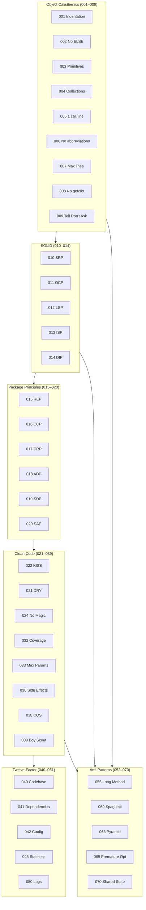
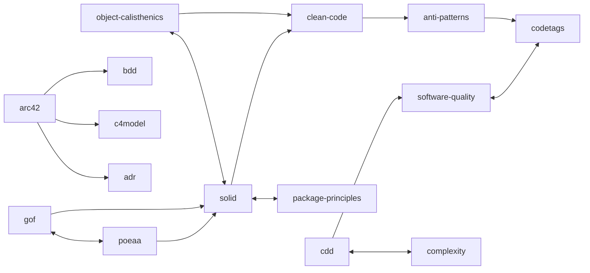

```mermaid
graph LR
  s_oc["skill: object-calisthenics"] --> r001 & r002 & r003 & r004 & r005 & r006 & r007 & r008 & r009
  s_solid["skill: solid"] --> r010 & r011 & r012 & r013 & r014
  s_pp["skill: package-principles"] --> r015 & r016 & r017 & r018 & r019 & r020
  s_cc["skill: clean-code"] --> r021 & r022 & r024 & r032 & r033 & r036 & r038 & r039
  s_tf["skill: twelve-factor"] --> r040 & r041 & r042 & r045 & r050
  s_ap["skill: anti-patterns"] --> r052 & r053 & r054 & r055 & r056 & r057 & r058 & r059 & r060 & r061 & r062 & r063 & r064 & r065 & r066 & r067 & r068 & r069 & r070
  s_cdd["skill: cdd"] --> r001 & r010 & r014 & r018 & r022 & r066
  s_comp["skill: complexity"] --> r001 & r022
  s_bigo["skill: big-o"] --> r001 & r007 & r022
```

# oh my claude — Dependency Graph

Dependency map between rules, skills and agents.

---

## Rule Layers

---

## Skills → Rules

---

## Skills → Skills

---

## Agents → Skills → Rules

```mermaid
graph TD
  leader["@leader"] --> s_cdd["skill: cdd"]

  architect["@architect"] --> s_gof["gof"] & s_poeaa["poeaa"] & s_solid["solid"] & s_pp["package-principles"]
  architect --> s_arc42["arc42"] & s_c4["c4model"] & s_adr["adr"] & s_bdd["bdd"]
  architect --> s_sq["software-quality"]

  developer["@developer"] --> s_oc["object-calisthenics"] & s_solid & s_pp
  developer --> s_cc["clean-code"] & s_tf["twelve-factor"] & s_ap["anti-patterns"]
  developer --> s_col["colocation"] & s_rev["revelation"]

  tester["@tester"] --> s_comp["complexity"] & s_sq & s_cc & s_col

  reviewer["@reviewer"] --> s_cdd & s_ap & s_sq & s_ct["codetags"]

  s_oc --> r001_009["Rules 001–009"]
  s_solid --> r010_014["Rules 010–014"]
  s_pp --> r015_020["Rules 015–020"]
  s_cc --> r021_039["Rules 021–039"]
  s_tf --> r040_051["Rules 040–051"]
  s_ap --> r052_070["Rules 052–070"]
```

---

## Legend

| Symbol | Meaning |
|---------|-------------|
| `→` | uses / references |
| `↔` | bidirectional |
| `skill: X` | file in `.claude/skills/X/SKILL.md` |
| `Rule NNN` | file in `.claude/rules/NNN_*.md` |

---

**Updated on:** 2026-04-01
