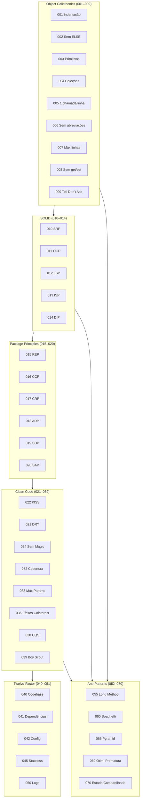
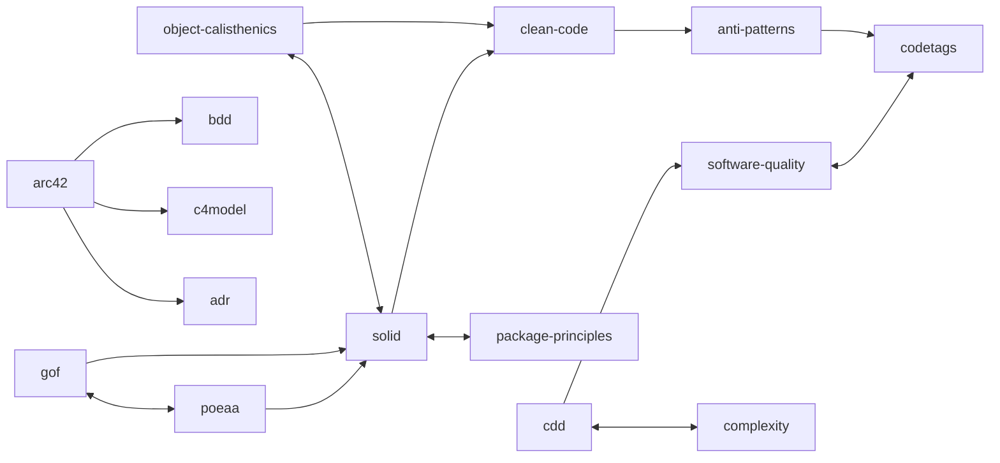
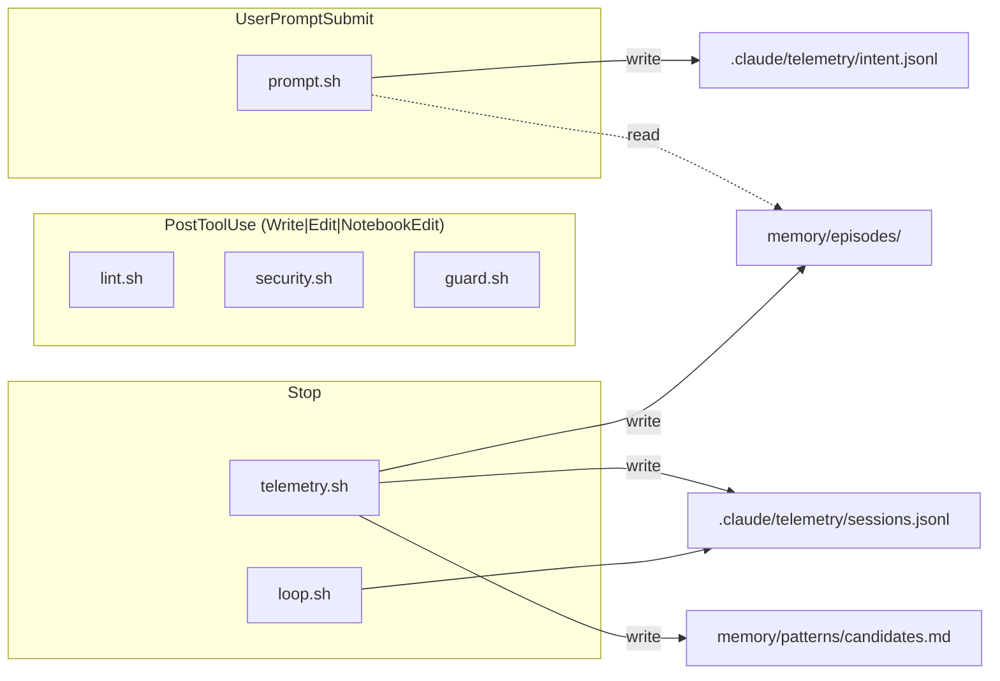

# oh my claude — Grafo de Dependências

Mapa de dependências entre regras, skills e agentes.

---

## Camadas de Regras

---

## Skills → Regras

```mermaid
graph LR
  s_oc["skill: object-calisthenics"] --> r001 & r002 & r003 & r004 & r005 & r006 & r007 & r008 & r009
  s_solid["skill: solid"] --> r010 & r011 & r012 & r013 & r014
  s_pp["skill: package-principles"] --> r015 & r016 & r017 & r018 & r019 & r020
  s_cc["skill: clean-code"] --> r021 & r022 & r024 & r032 & r033 & r036 & r038 & r039
  s_tf["skill: twelve-factor"] --> r040 & r041 & r042 & r045 & r050
  s_ap["skill: anti-patterns"] --> r052 & r053 & r054 & r055 & r056 & r057 & r058 & r059 & r060 & r061 & r062 & r063 & r064 & r065 & r066 & r067 & r068 & r069 & r070
  s_cdd["skill: cdd"] --> r001 & r010 & r014 & r018 & r022 & r066
  s_comp["skill: complexity"] --> r001 & r022
  s_bigo["skill: big-o"] --> r001 & r007 & r022
```

---

## Skills → Skills

---

## Agentes → Skills → Regras

```mermaid
graph TD
  tech_lead["Tech Lead (Claude Code)"] --> planner["@planner"]
  tech_lead --> deepdive["@deepdive"]

  planner["@planner"] --> s_cdd["skill: cdd"]
  planner --> s_col["colocation"]

  architect["@architect"] --> s_gof["gof"] & s_poeaa["poeaa"] & s_solid["solid"] & s_pp["package-principles"]
  architect --> s_arc42["arc42"] & s_c4["c4model"] & s_adr["adr"] & s_bdd["bdd"]
  architect --> s_sq["software-quality"] & s_cdd & s_ct["codetags"]

  designer["@designer"] --> s_tok["token"] & s_an["anatomy"] & s_ev["event"] & s_st["state"]
  designer --> s_ren["render"] & s_sto["story"] & s_react["react"]

  coder["@coder"] --> s_oc["object-calisthenics"] & s_solid & s_pp
  coder --> s_cc["clean-code"] & s_tf["twelve-factor"] & s_ap["anti-patterns"]
  coder --> s_col & s_rev["revelation"]

  tester["@tester"] --> s_comp["complexity"] & s_sq & s_cc & s_col

  deepdive["@deepdive"] --> s_bigo["big-o"] & s_comp["complexity"] & s_cdd
  deepdive --> s_gof["gof"] & s_poeaa["poeaa"] & s_ap["anti-patterns"]
  deepdive --> s_sq

  s_oc --> r001_009["Regras 001–009"]
  s_solid --> r010_014["Regras 010–014"]
  s_pp --> r015_020["Regras 015–020"]
  s_cc --> r021_039["Regras 021–039"]
  s_tf --> r040_051["Regras 040–051"]
  s_ap --> r052_070["Regras 052–070"]
```

---

## Hooks → Eventos

`loop.sh` e `telemetry.sh` são acionados em sequência no evento `Stop`: `loop.sh` decide se a resposta pode encerrar (bloqueia se existir `- [ ]` pendente em `changes/*/tasks.md`), `telemetry.sh` (1) registra trace JSON da sessão com `session_id`, `mode`, `feature`, `tasks` (pending/done), `attempts` (coder/tester) e `violations`; (2) se a feature foi concluída, materializa episódio em `memory/episodes/YYYY-MM-DD_feature.md`; (3) se `attempts_coder=1`, appenda candidato em `memory/patterns/candidates.md`.

`prompt.sh` complementa o ciclo: em cada `UserPromptSubmit`, faz leitura (seta tracejada) de `memory/episodes/` para injetar top-2 episódios similares no system prompt — fechando o loop write→read entre sessões.

---

## Progressive Disclosure (Skills)

Skills seguem o padrão de carregamento em 3 níveis — o runtime carrega apenas o necessário:

| Nível | Conteúdo | Quando carrega |
|-------|----------|----------------|
| 1 | Frontmatter YAML (`name`, `description`) | Discovery — runtime varre todos os skills |
| 2 | `## Manifest` (applicability, prerequisites, constraints, scope) | Candidato — skill foi selecionado como potencialmente relevante |
| 3 | `references/*.md` | Ativo — skill está em uso efetivo durante execução |

A seção `## Manifest` em `SKILL.md` (ex: `skills/clean-code/SKILL.md`, `skills/colocation/SKILL.md`) expõe metadados estruturados para que o runtime decida carregar detalhes de `references/` apenas quando o skill entra em execução.

---

## Legenda

| Símbolo | Significado |
|---------|-------------|
| `→` | usa / referencia |
| `↔` | bidirecional |
| `skill: X` | arquivo em `.claude/skills/X/SKILL.md` |
| `Rule NNN` | arquivo em `.claude/rules/NNN_*.md` |

---

**Atualizado em:** 2026-04-19
