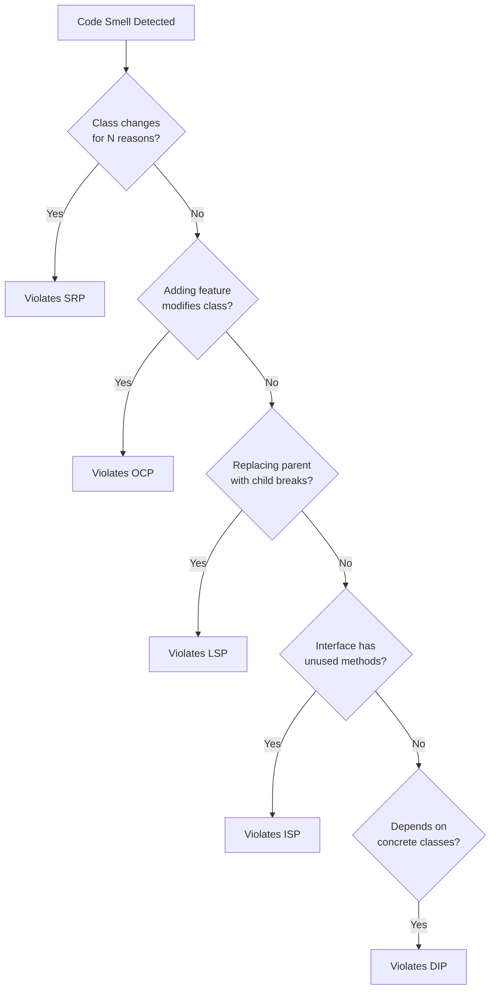

# SOLID Principles

## What It Is

SOLID is an acronym for 5 fundamental principles of object-oriented design created by Robert C. Martin (Uncle Bob). These principles form the basis for clean, maintainable, and scalable code in OOP systems.

## When to Use

- **@architect designing system**: Apply when deciding class, interface and dependency design
- **@developer implementing features**: Validate that code follows the 5 principles during writing
- **@reviewer checking code**: Use as checklist to identify architectural violations
- **Refactoring**: Diagnose which principle was violated to guide refactoring

## SOLID Principles

| Letter | Principle | Rule ID | Key Question | File |
|--------|-----------|---------|--------------|------|
| **S** | Single Responsibility | 010 | Does this class have a single reason to change? | [srp.md](references/srp.md) |
| **O** | Open/Closed | 011 | Can I add behavior without modifying existing code? | [ocp.md](references/ocp.md) |
| **L** | Liskov Substitution | 012 | Can I replace base class with derived without breaking? | [lsp.md](references/lsp.md) |
| **I** | Interface Segregation | 013 | Do clients depend only on interfaces they use? | [isp.md](references/isp.md) |
| **D** | Dependency Inversion | 014 | Do high-level modules depend on abstractions, not concretes? | [dip.md](references/dip.md) |

## Quick Guide: Which Principle Was Violated?

```
Class changes for multiple reasons?                    → S: Single Responsibility
Adding feature requires modifying existing class?      → O: Open/Closed
Replacing parent with child breaks behavior?           → L: Liskov Substitution
Interface forces client to implement empty methods?    → I: Interface Segregation
Service instantiates concrete classes with new?        → D: Dependency Inversion
```

## Decision Tree: Violating Which Principle?



## Prohibitions

These combinations violate **multiple** SOLID principles simultaneously:

```typescript
// ❌ Violates S, O, D
class UserManager {  // SRP: multiple responsibilities
  processUser(userId: string) {  // DIP: instantiates concretes
    const db = new MySQLDatabase();  // DIP violated
    const user = db.getUser(userId);

    if (user.type === 'premium') {  // OCP violated: if/type
      this.processPremium(user);
    } else if (user.type === 'basic') {
      this.processBasic(user);
    }
  }

  processPremium(user: User) { /* ... */ }
  processBasic(user: User) { /* ... */ }
  sendEmail(user: User) { /* ... */ }  // SRP: extra responsibility
  logActivity(user: User) { /* ... */ }  // SRP: extra responsibility
}
```

✅ **Correct**: each violation must be fixed by applying the corresponding principle.

## Rationale

SOLID forms the basis of clean and testable architecture:

- **SRP + ISP**: reduce coupling, facilitate isolated tests
- **OCP + LSP**: allow extension without modification, ensure substitutability
- **DIP**: inverts dependencies, enabling injection and mocking

### Interaction Between Principles

```
DIP ─────> enables ─────> OCP
 │                         │
 └──> supports ──> LSP ─────┘
      │
      └──> requires ──> ISP
                        │
                        └──> reinforces ──> SRP
```

## Examples

### ✅ All 5 Principles Applied

```typescript
// S: One responsibility - process orders
// O: Open for extension via Strategy
// L: PaymentStrategy subclasses are substitutable
// I: PaymentStrategy interface is specific
// D: Depends on abstraction (PaymentStrategy), not concrete
class OrderProcessor {
  constructor(
    private readonly paymentStrategy: PaymentStrategy,  // D: abstraction
    private readonly orderRepository: OrderRepository   // D: abstraction
  ) {}

  process(order: Order): void {  // S: single responsibility
    this.validateOrder(order);
    this.paymentStrategy.pay(order);  // O: extensible via Strategy
    this.orderRepository.save(order);
  }

  private validateOrder(order: Order): void {
    if (!order.isValid()) {
      throw new InvalidOrderError();
    }
  }
}

// I: Specific interface for payment
interface PaymentStrategy {  // I: 1 method = ISP
  pay(order: Order): void;
}

// L: Substitutable by PaymentStrategy
class CreditCardPayment implements PaymentStrategy {
  pay(order: Order): void {
    // Specific implementation
  }
}

// L: Substitutable by PaymentStrategy
class PayPalPayment implements PaymentStrategy {
  pay(order: Order): void {
    // Specific implementation
  }
}
```

## Links to deMGoncalves Rules

- **S**: [010 - Single Responsibility Principle](../../rules/010_principio-responsabilidade-unica.md)
- **O**: [011 - Open/Closed Principle](../../rules/011_principio-aberto-fechado.md)
- **L**: [012 - Liskov Substitution Principle](../../rules/012_principio-substituicao-liskov.md)
- **I**: [013 - Interface Segregation Principle](../../rules/013_principio-segregacao-interfaces.md)
- **D**: [014 - Dependency Inversion Principle](../../rules/014_principio-inversao-dependencia.md)

**Related skills:**
- [`object-calisthenics`](../object-calisthenics/SKILL.md) — complements: OC applies SOLID at tactical level
- [`package-principles`](../package-principles/SKILL.md) — depends: package principles extend SOLID to modules
- [`clean-code`](../clean-code/SKILL.md) — reinforces: SOLID is pillar of Clean Code

---

**Created on**: 2026-04-01
**Version**: 1.0.0
