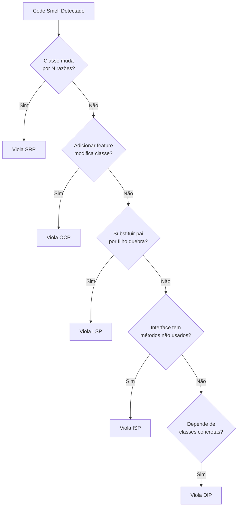

# Princípios SOLID

---

## Manifest

| Campo | Valor |
|-------|-------|
| **Aplicabilidade** | Ao decidir design de classes e interfaces; ao verificar conformidade arquitetural em code reviews; ao diagnosticar qual princípio foi violado para guiar refatoração |
| **Pré-requisitos** | Conceitos OOP (herança, composição, polimorfismo, interfaces); skill `object-calisthenics` (OC aplica SOLID em nível tático) |
| **Restrições** | Não aplicar DIP em Entidades/Value Objects ou no Root Composer — esses podem instanciar concretos; não criar interfaces de 1 método só por cumprir ISP quando não há variação real de comportamento |
| **Escopo** | Os 5 princípios SOLID (SRP, OCP, LSP, ISP, DIP) mapeados para rules 010–014, incluindo árvore de decisão e exemplos de violações simultâneas |

---

## O que É

SOLID é um acrônimo para 5 princípios fundamentais de design orientado a objetos criados por Robert C. Martin (Uncle Bob). Esses princípios formam a base para código limpo, manutenível e escalável em sistemas OOP.

## Quando Usar

- **@architect projetando sistema**: Aplicar ao decidir design de classes, interfaces e dependências
- **@coder implementando features**: Validar que código segue os 5 princípios durante escrita
- **@architect verificando código**: Usar como checklist para identificar violações arquiteturais
- **Refatoração**: Diagnosticar qual princípio foi violado para guiar refatoração

## Princípios SOLID

| Letra | Princípio | ID Rule | Pergunta-Chave | Arquivo |
|-------|-----------|---------|----------------|---------|
| **S** | Single Responsibility | 010 | Esta classe tem uma única razão para mudar? | [srp.md](references/srp.md) |
| **O** | Open/Closed | 011 | Posso adicionar comportamento sem modificar código existente? | [ocp.md](references/ocp.md) |
| **L** | Liskov Substitution | 012 | Posso substituir classe base por derivada sem quebrar? | [lsp.md](references/lsp.md) |
| **I** | Interface Segregation | 013 | Clientes dependem apenas de interfaces que usam? | [isp.md](references/isp.md) |
| **D** | Dependency Inversion | 014 | Módulos de alto nível dependem de abstrações, não concretos? | [dip.md](references/dip.md) |

## Guia Rápido: Qual Princípio Foi Violado?

```
Classe muda por múltiplas razões?                      → S: Single Responsibility
Adicionar feature requer modificar classe existente?   → O: Open/Closed
Substituir pai por filho quebra comportamento?         → L: Liskov Substitution
Interface força cliente a implementar métodos vazios?  → I: Interface Segregation
Service instancia classes concretas com new?           → D: Dependency Inversion
```

## Árvore de Decisão: Violando Qual Princípio?



## Proibições

Essas combinações violam **múltiplos** princípios SOLID simultaneamente:

```typescript
// ❌ Viola S, O, D
class UserManager {  // SRP: múltiplas responsabilidades
  processUser(userId: string) {  // DIP: instancia concretos
    const db = new MySQLDatabase();  // DIP violado
    const user = db.getUser(userId);

    if (user.type === 'premium') {  // OCP violado: if/type
      this.processPremium(user);
    } else if (user.type === 'basic') {
      this.processBasic(user);
    }
  }

  processPremium(user: User) { /* ... */ }
  processBasic(user: User) { /* ... */ }
  sendEmail(user: User) { /* ... */ }  // SRP: responsabilidade extra
  logActivity(user: User) { /* ... */ }  // SRP: responsabilidade extra
}
```

✅ **Correto**: cada violação deve ser corrigida aplicando o princípio correspondente.

## Justificativa

SOLID forma a base da arquitetura limpa e testável:

- **SRP + ISP**: reduzem acoplamento, facilitam testes isolados
- **OCP + LSP**: permitem extensão sem modificação, garantem substituibilidade
- **DIP**: inverte dependências, permitindo injeção e mocking

### Interação Entre Princípios

```
DIP ─────> habilita ─────> OCP
 │                          │
 └──> suporta ──> LSP ──────┘
      │
      └──> requer ──> ISP
                       │
                       └──> reforça ──> SRP
```

## Exemplos

### ✅ Todos os 5 Princípios Aplicados

```typescript
// S: Uma responsabilidade - processar pedidos
// O: Aberto para extensão via Strategy
// L: Subclasses PaymentStrategy são substituíveis
// I: Interface PaymentStrategy é específica
// D: Depende de abstração (PaymentStrategy), não concreto
class OrderProcessor {
  constructor(
    private readonly paymentStrategy: PaymentStrategy,  // D: abstração
    private readonly orderRepository: OrderRepository   // D: abstração
  ) {}

  process(order: Order): void {  // S: responsabilidade única
    this.validateOrder(order);
    this.paymentStrategy.pay(order);  // O: extensível via Strategy
    this.orderRepository.save(order);
  }

  private validateOrder(order: Order): void {
    if (!order.isValid()) {
      throw new InvalidOrderError();
    }
  }
}

// I: Interface específica para pagamento
interface PaymentStrategy {  // I: 1 método = ISP
  pay(order: Order): void;
}

// L: Substituível por PaymentStrategy
class CreditCardPayment implements PaymentStrategy {
  pay(order: Order): void {
    // Implementação específica
  }
}

// L: Substituível por PaymentStrategy
class PayPalPayment implements PaymentStrategy {
  pay(order: Order): void {
    // Implementação específica
  }
}
```

## Links para Rules deMGoncalves

- **S**: [010 - Princípio da Responsabilidade Única](../../rules/010_principio-responsabilidade-unica.md)
- **O**: [011 - Princípio Aberto/Fechado](../../rules/011_principio-aberto-fechado.md)
- **L**: [012 - Princípio de Substituição de Liskov](../../rules/012_principio-substituicao-liskov.md)
- **I**: [013 - Princípio de Segregação de Interface](../../rules/013_principio-segregacao-interfaces.md)
- **D**: [014 - Princípio de Inversão de Dependência](../../rules/014_principio-inversao-dependencia.md)

**Skills relacionadas:**
- [`object-calisthenics`](../object-calisthenics/SKILL.md) — complementa: OC aplica SOLID em nível tático
- [`package-principles`](../package-principles/SKILL.md) — depende: princípios de pacote estendem SOLID a módulos
- [`clean-code`](../clean-code/SKILL.md) — reforça: SOLID é pilar do Clean Code

---

**Criada em**: 2026-04-01
**Versão**: 1.0.0
